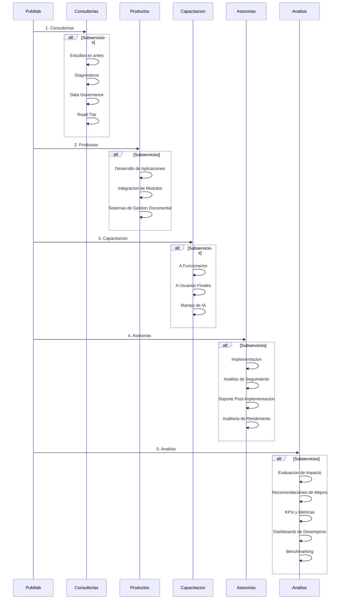

# Plan de Negocios – Publilab Consulting

## 1. Resumen Ejecutivo

Publilab Consulting es una startup disruptiva cuyo propósito es transformar la gestión pública en Chile a través de la adopción de soluciones tecnológicas avanzadas. La empresa se centra, inicialmente, en dos productos principales: **MunBot** y **MunDat**. **MunBot** es un asistente virtual inteligente que utiliza procesamiento de lenguaje natural y machine learning para ofrecer atención ciudadana 24/7, automatizando la respuesta a consultas, la gestión de citas y la tramitación de solicitudes, entre otros servicios ofertados por las instituciones públicas. Las características principales de **MunBot** son, por una parte, servir como un agente articulador de otras aplicaciones dentro del sistema de acciones de las organizaciones públicas, es decir, funciona como un trigger capaz de ejecutar acciones de una manera fácil e intuitiva a los requerimientos de los usuarios, que ejecuta distintas aplicaciones dentro del agente a través de instrucciones previamente programadas. **MunDat**, por su parte, es una plataforma analítica que consolida datos provenientes de diversas fuentes internas y externas, permitiendo a las instituciones públicas tomar decisiones basadas en distintos tipos de análisis estadístico y en información en tiempo real. Estas soluciones no solo facilitan la digitalización de procesos, sino que también permiten optimizar recursos, mejorar la transparencia y aumentar la eficiencia operativa de las instituciones públicas.

La estrategia de Publilab se estructura en tres fases bien definidas. En la Fase 1 se establece una alianza con una o dos municipalidad partner, que actuarán como laboratorio para probar, ajustar y validar los productos en un entorno real. Durante la Fase 2, tras la validación del piloto, la empresa expandirá su oferta comercial a otras municipalidades y entidades públicas, utilizando un modelo basado en licencias y suscripciones mensuales, adaptables según las necesidades específicas de cada institución. Finalmente, la Fase 3 se orienta a la consolidación y escalabilidad del modelo de negocio a nivel nacional, incorporando nuevas funcionalidades y módulos adicionales, y diversificando las fuentes de financiamiento mediante fondos públicos, inversión ángel y subvenciones públicas. Con este enfoque, Publilab Consulting espera posicionarse como un actor clave en la transformación digital del sector público, generando impacto tanto en términos operativos como en el bienestar de los ciudadanos.

---
## 2. Descripción de la Empresa

Publilab Consulting se constituye como una Sociedad por Acciones (SpA), lo que brinda una gran flexibilidad para la incorporación de nuevos inversores y la estructuración de una administración ágil, aspectos fundamentales para una startup que busca crecer rápidamente en un sector en plena transformación. La misión de la empresa es clara: transformar la gestión pública mediante el uso de herramientas tecnológicas innovadoras que faciliten la interacción entre el Estado y la ciudadanía, reduzcan la burocracia y permitan una administración basada en datos. La visión de Publilab es ser reconocido a nivel nacional como un motor de digitalización en el sector público, liderando la evolución de procesos tradicionales hacia modelos más eficientes, transparentes y centrados en el ciudadano.

Los valores de Publilab – excelencia, innovación, compromiso, ética, trabajo en equipo, responsabilidad social y búsqueda constante del conocimiento – se integran en cada aspecto de su operación. Estos valores no solo definen la cultura interna de la empresa, sino que también se reflejan en la forma en que interactúa con sus clientes, asegurando que las soluciones ofrecidas sean de alta calidad, produzcan beneficios tangibles, se mantengan a la vanguardia tecnológica y estén alineadas con las necesidades reales de las instituciones públicas. La ubicación estratégica en la Provincia de Colchagua, y la alianza con una municipalidad partner, permiten a Publilab desarrollar sus soluciones en un entorno real y con un impacto directo en la gestión local, sirviendo de modelo replicable en todo el país.

---
## 3. Análisis de Mercado

En una fase inicial, el mercado objetivo de Publilab Consulting está compuesto principalmente por las municipalidades chilenas. Con la obligación de digitalizar los procesos administrativos establecida por la Ley N° 21.180, las 345 municipalidades de Chile se ven en la necesidad de modernizar sus sistemas para mejorar la atención a la ciudadanía y optimizar la asignación de recursos. En este sentido, la transformación digital ofrece oportunidades para el uso de datos y la inclusión de aplicaciones informáticas que automaticen procesos al interior de las instituciones pública. Este contexto crea una oportunidad única para introducir soluciones integrales que no solo digitalicen los trámites, sino que también proporcionen análisis predictivos y herramientas de gestión basadas en datos.

Las necesidades de las municipalidades se centran en la digitalización de procesos que tradicionalmente han dependido de sistemas manuales y en papel, lo que genera ineficiencias y altos costos operativos, lo que sumado a la obligación por parte de la ley de **transformación digital del Estado**, generará una cantidad significativa de datos que pueden ser aprovechados en los procesos de gestión estatal. La integración de soluciones que permitan automatizar la atención ciudadana y consolidar información dispersa en una única plataforma analítica es fundamental para superar estas barreras. Además, la tendencia global hacia la transformación digital y la creciente demanda de transparencia y rendición de cuentas en la gestión pública fortalecen la oportunidad de mercado. En este sentido, Publilab no solo se posiciona para cumplir con un mandato legal, sino que también responde a una demanda creciente de eficiencia y modernización en el sector público.

Aunque existen competidores que ofrecen soluciones digitales, muchos de ellos se centran en aspectos aislados del proceso de digitalización, como la automatización de trámites o el análisis de datos de manera independiente. La propuesta de Publilab es única en el sentido de que integra ambas capacidades en una solución holística, permitiendo a las municipalidades transformar integralmente su gestión operativa, reducir costos y mejorar la experiencia ciudadana, diferenciándose así en un mercado cada vez más competitivo.

### Competidores

1. **Grandes Empresas de Servicios TI y Consultoría (Nacionales e Internacionales):** Estas empresas suelen tener contratos marco o relaciones de largo plazo con el Estado y participan en grandes proyectos de modernización y transformación digital. Aunque quizás no ofrezcan exactamente los mismos productos de nicho (IA específica para municipios), compiten por el presupuesto tecnológico del sector público.

   - **Sonda:** Una de las mayores empresas TI de origen chileno con fuerte presencia en Latinoamérica. Ofrece una amplia gama de servicios, incluyendo desarrollo de software, outsourcing e integración de sistemas para el sector público y privado.
   - **Adexus:** Empresa chilena (parte del grupo Graña y Montero) con experiencia en integración de sistemas, comunicaciones y servicios TI, incluyendo clientes en el sector gobierno.
   - **Accenture, Deloitte, EY, PwC, KPMG:** Las "Big Four" y otras grandes consultoras globales tienen divisiones de consultoría tecnológica y de gestión que trabajan con el sector público en Chile en proyectos de estrategia digital, optimización de procesos y implementación de tecnologías.
   - **NTT Data (anteriormente Everis):** Fuerte presencia en Chile, ofreciendo consultoría y soluciones tecnológicas, incluyendo transformación digital para el sector público.
   - **IBM Chile:** Ofrece soluciones de IA (Watson), análisis de datos, cloud y consultoría, aplicables al sector público.
   - **Indra:** Empresa española con operaciones significativas en Chile, trabajando en proyectos tecnológicos para diversos sectores, incluyendo administraciones públicas y defensa.
      
2. **Proveedores Especializados en Software de Gestión Municipal:** Estas empresas se centran en sistemas ERP, financieros, de recursos humanos, patentes, permisos de circulación, etc., para municipalidades. Tienen una base instalada significativa y relaciones directas con los municipios, lo que los convierte en competidores importantes por el presupuesto y la atención de los clientes municipales.
    
   - **CAS Chile:** Uno de los actores más reconocidos en software de gestión para municipalidades en Chile.
   - **Soluciones SM (Software Municipal):** Otro proveedor relevante con un portafolio de soluciones para la administración municipal.
   - **Informat Municipal:** División de la empresa Informat que provee software ERP y soluciones específicas para el sector municipal.
   - **(Pueden existir otros actores regionales o más pequeños)**: Empresas con focos más específicos o presencia en ciertas regiones del país.

3. **Empresas de Desarrollo de Software a Medida y Consultoría Tecnológica Local:** Empresas chilenas de menor tamaño que las grandes consultoras, pero que ofrecen desarrollo de software, integración o consultoría tecnológica y pueden tener experiencia trabajando con organismos públicos.

   - **CAS Chile:** Uno de los actores más reconocidos en software de gestión para municipalidades en Chile.
   - **Soluciones SM (Software Municipal):** Otro proveedor relevante con un portafolio de soluciones para la administración municipal.
   - **Informat Municipal:** División de la empresa Informat que provee software ERP y soluciones específicas para el sector municipal.
   - **(Pueden existir otros actores regionales o más pequeños)**: Empresas con focos más específicos o presencia en ciertas regiones del país.
   - **Tecnomark:** Agencia ubicada en Los Andes que ofrece marketing digital, desarrollo de software y soluciones TI. Su tamaño (11-50 empleados según Sortlist) la sitúa en el segmento PYME/Mediana.
   - **ByteU:** Agencia digital más pequeña (1-10 empleados según Sortlist) basada en Santiago. Se especializa en diseño web, tiendas online, pero también en desarrollo de software a medida y menciona experiencia en el sector salud, lo cual puede indicar capacidad para trabajar en entornos regulados o complejos.
   - **Conhéctor Consultores:** Empresa en Santiago (1-10 empleados según Sortlist) enfocada en transformación digital, ofreciendo desarrollo de sitios web, aplicaciones, y análisis de datos. Su foco en optimizar procesos mediante tecnología es relevante.
   - **ZopiTech SpA:** Empresa en Santiago (1-10 empleados según Sortlist) que se dedica a soluciones TI y desarrollo de software específicamente para "empresas en crecimiento". Representa el tipo de desarrollador local que podría tomar proyectos a medida.
   - **Grep:** Aunque mencionada en un contexto de IA/Robótica, tiene más de 20 años y se especializa en automatización de procesos mediante RPA (Robotic Process Automation). Dado que Publilab también toca la automatización, Grep podría ser un competidor en ese frente, adaptando sus servicios a procesos públicos.

   **Empresas de Consultoría Tecnológica y Transformación Digital Locales/Medianas:**

   - **Lisit:** Se presenta explícitamente como una empresa chilena de consultoría TI y transformación digital con sede en Providencia, Santiago. Ofrecen un portafolio amplio que incluye Desarrollo de Software y Aplicaciones, Data & Analytics, Cloud y Ciberseguridad. Parecen un competidor relevante en el ámbito de la consultoría y desarrollo para empresas que buscan modernizarse.
   - **ACLTICL:** Aunque el resultado es un artículo de ellos, ACL Technology & Consulting es una empresa chilena que ofrece servicios de consultoría TI, desarrollo de software, outsourcing y data analytics. Tienen experiencia y tamaño considerable en el mercado local.
   - **OpenSistemas:** Aunque de origen español, tienen presencia y operaciones en Chile. Se especializan fuertemente en soluciones de datos e Inteligencia Artificial, compitiendo directamente en el nicho tecnológico de Publilab, aunque quizás con un enfoque inicial menos específico en el sector público municipal.
   - **DACSI:** Mencionada en el contexto de IA en Chile, probablemente sea una empresa local enfocada en datos o inteligencia artificial que valdría la pena investigar más a fondo.

   **Consideraciones Adicionales:**
   - **Verificación de Experiencia Pública:** Es importante notar que, si bien estas empresas tienen las capacidades técnicas (desarrollo a medida, consultoría, datos), su experiencia _específica_ y _profunda_ trabajando con **municipalidades chilenas** o implementando **soluciones de IA/Predictivas en el sector público** no siempre es pública. Publilab podría diferenciarse por esta especialización.
   - **Portal Mercado Público (ChileCompra):** Una forma más directa de verificar qué empresas de este tipo han trabajado con el Estado (incluyendo municipalidades) es revisar licitaciones y adjudicaciones pasadas en el portal de compras públicas de Chile. Esto puede revelar nombres de competidores locales activos en el sector.
   - **Ecosistema Amplio:** Existen muchas otras "software factories" y consultoras TI de diversos tamaños en Chile. La lista anterior representa ejemplos encontrados que encajan en el perfil buscado.

4. **Empresas Emergentes (Startups) en GovTech o IA/Analytics:** Aunque el nicho específico de IA para _municipalidades_ puede estar menos desarrollado, podrían existir startups chilenas enfocadas en:
    
5. 1. **Ecosistemas GovTech y Conectores:**
      * **GovTech LATAM:** Esta iniciativa (apoyada por BID Lab y IE PublicTech Lab) conecta startups con municipalidades en Latinoamérica para pilotar soluciones. Su existencia valida el interés en el área. Han listado startups chilenas participantes en sus programas, como:
      * **Núcleo ODS SpA:** Probablemente enfocada en soluciones relacionadas con los Objetivos de Desarrollo Sostenible (ODS), que tienen alta relevancia para la gestión pública.
      * **RAFI:** (Requiere más investigación sobre su foco específico, pero listada en contexto GovTech).
      * **UNIBOX / Mobilbox:** Posiblemente relacionada con soluciones móviles o de gestión logística/operativa que podrían aplicarse a municipios.
      * **Laboratorio de Gobierno (Lab.Gob):** No es una startup, sino una agencia estatal clave. Actúa como un **facilitador**, conectando desafíos públicos con soluciones innovadoras (que pueden venir de startups) y promoviendo capacidades de innovación dentro del Estado. Publilab debería conocer su trabajo y potenciales convocatorias o desafíos.
      * **Start-Up Chile (CORFO):** Es la principal aceleradora pública y una fuente constante de nuevas startups tecnológicas en Chile. Muchas de las startups relevantes en IA/Datos han pasado por sus programas (Build, Ignite, Growth).
6. 2. ** **Startups Chilenas con Foco en IA / Data Analytics (Identificadas principalmente a través de Start-Up Chile y otras fuentes):**
      * **ACELER.AI:** Plataforma SaaS para implementar proyectos de IA de forma más eficiente. Tecnología directamente aplicable.
      * **Aindez:** Plataforma de IA para centralizar y automatizar la gestión de personas (RRHH), conectando datos. Podría adaptarse a la gestión de funcionarios públicos.
      * **SAFEGUARD360:** Ecosistema de seguridad basado en AI y IoT para ciudades, vehículos y personas. Claramente en el espacio GovTech/Smart City.
      * **SyncroPro:** Aplicación de gestión de turnos con IA para optimizar horarios. Relevante para la gestión de personal en servicios públicos.
      * **Versu:** Agente de IA que analiza conversaciones con clientes (o ciudadanos) para obtener insights y automatizar procesos. Podría competir/complementar la funcionalidad de un "MunBot".
      * **2IT:** Soluciones de software basadas en mapas para planificación y operación territorial. Potencialmente útil para municipios.
      * **Tazki:** SaaS para digitalizar y gestionar procesos de Prevención de Riesgos y Seguridad Ocupacional (HSEQ). Aplicable a la gestión interna municipal.
      * **Otras mencionadas (requieren más análisis):** DACSI (IA), Grep (RPA), potencialmente algunas de la lista de Prochile como Audisis (¿auditoría/datos?), Hackmetrix (ciberseguridad), Movizzon (¿movilidad/datos?), Pegasi (experiencia con datos sensibles), Raven (¿monitoreo/inteligencia?), Red-Apis (integración).
7. 3. **Startups en Áreas Adyacentes o con Foco Específico:**
      * **Tu Firma Digital:** Startup mencionada en la delegación de Prochile, directamente relevante para la digitalización de trámites gubernamentales.
      * Pueden existir startups enfocadas en áreas como participación ciudadana digital, transparencia, gestión de trámites específicos, plataformas de comunicación gobierno-ciudadano, que aunque no usen IA compleja inicialmente, compiten por la atención y presupuesto de modernización municipal.

### **Conclusión sobre Competencia Emergente:**
Si bien puede que no haya (aún) una gran cantidad de startups chilenas haciendo *exactamente* lo mismo que Publilab (IA predictiva *específicamente* para gestión municipal general), sí existe un ecosistema creciente:
Hay startups **GovTech** abordando problemas públicos específicos (ODS, seguridad ciudadana, trámites digitales).
Hay un número significativo de startups locales con **fuertes capacidades en IA y Data Analytics** (muchas impulsadas por Start-Up Chile) que *podrían* adaptar sus tecnologías al sector público si ven la oportunidad. Empresas como ACELER.AI, Aindez o Versu poseen la base tecnológica relevante.
Actores como **GovTech LATAM** y **Laboratorio de Gobierno** están activamente tratando de fomentar la conexión entre problemas públicos y soluciones tecnológicas innovadoras, lo que puede acelerar la aparición de más competidores o colaboradores.

#### **Oportunidades frente a la Competencia:**
Publilab tiene una oportunidad significativa para diferenciarse gracias a su enfoque especializado en Inteligencia Artificial y análisis predictivo aplicado específicamente al nicho municipal chileno. Mientras que las grandes consultoras internacionales (como Accenture, Deloitte) y los grandes integradores (IBM, Indra) poseen recursos y reputación, a menudo carecen de la agilidad y la especialización profunda que Publilab puede ofrecer para las necesidades particulares de una municipalidad. Suelen enfocarse en contratos gubernamentales de mayor envergadura, dejando un espacio para que Publilab atienda a municipios con soluciones más adaptadas y posiblemente a un costo más competitivo. De manera similar, frente a grandes empresas TI nacionales como Sonda y Adexus, que tienen una fuerte presencia local pero un portafolio de servicios más amplio, Publilab puede destacar por su innovación específica en IA, ofreciendo soluciones de vanguardia que estos actores más establecidos podrían tardar en desarrollar o adaptar.
Otra oportunidad reside en la relación con los proveedores de software de gestión municipal (ERP/Administrativo) existentes como CAS Chile o Soluciones SM. Aunque son competidores fuertes por el presupuesto y las relaciones existentes, su foco actual no está en la IA avanzada. Esto abre la puerta para que Publilab ofrezca soluciones complementarias que se integren con estos sistemas incumbentes, aportando una capa de inteligencia y análisis que actualmente falta. Además, existe la posibilidad de colaborar con consultoras de nicho especializadas en transformación digital (como Symnetics o Soaint), donde Publilab podría actuar como el socio tecnológico experto en IA, mientras la consultora aporta la visión estratégica y de procesos. Finalmente, al ser potencialmente pionera en el nicho específico de IA predictiva para gestión municipal, Publilab puede capitalizar la ventaja del primer movimiento frente a otras startups GovTech emergentes que podrían estar enfocadas en áreas diferentes como transparencia o participación ciudadana. Puede también beneficiarse indirectamente del conocimiento y talento generado por centros de investigación como el CSP de la U. de Chile o CENIA.

#### **Riesgos frente a la Competencia:**
El principal riesgo para Publilab proviene de la fuerte posición de los actores establecidos. Las grandes consultoras y empresas TI internacionales y nacionales (Accenture, Sonda, etc.) tienen la capacidad financiera, la reputación y las relaciones a largo plazo con el sector público que pueden dificultar la entrada de Publilab, especialmente en licitaciones más grandes. Estas empresas podrían decidir entrar agresivamente en el nicho de IA municipal, aprovechando sus recursos para desarrollar o adquirir capacidades, o simplemente ofreciendo soluciones de IA como parte de paquetes de servicios más amplios a precios competitivos.
Un riesgo particularmente significativo lo representan los proveedores de software de gestión municipal (ERP/Administrativo). Al ser los sistemas centrales de operación y poseer las relaciones existentes, tienen una fuerte barrera de entrada. Podrían optar por desarrollar sus propios módulos de IA "suficientemente buenos" para retener a sus clientes, aprovechando su base instalada y dificultando que los municipios adopten una solución externa como la de Publilab. La resistencia al cambio y los costos asociados a la integración con un nuevo proveedor también juegan en contra de Publilab frente a estos incumbentes.
Adicionalmente, aunque las consultoras de nicho pueden ser colaboradoras, también representan un riesgo si recomiendan a sus clientes soluciones tecnológicas alternativas o desarrollan alianzas con otros proveedores de IA. El ecosistema de startups GovTech, aunque emergente, es dinámico; nuevos competidores con enfoques similares o tecnologías disruptivas pueden surgir rápidamente, desafiando la posición de Publilab. Finalmente, aunque los centros de investigación no compiten comercialmente, existe el riesgo de que sus investigaciones generen conocimiento público que reduzca la ventaja competitiva de Publilab o que den lugar a spin-offs que se conviertan en competidores directos.

**Consideraciones Clave:**
- **Competencia Directa en IA/Predictivo Municipal:** Es probable que la competencia directa con soluciones _idénticas_ (Asistente IA + Plataforma Predictiva específicamente para municipios) sea limitada actualmente, lo que representa una oportunidad para Publilab.
- **Competencia por Presupuesto:** Publilab competirá principalmente con los proveedores de software de gestión municipal existentes y con las grandes consultoras por el presupuesto asignado a tecnología e innovación en las municipalidades.
- **Diferenciación:** La clave para Publilab será destacar su especialización en IA y análisis predictivo avanzado, su agilidad como startup y su modelo de "Municipalidad Partner" para demostrar valor rápidamente.

En resumen, el panorama competitivo es variado, incluyendo desde gigantes tecnológicos hasta proveedores de nicho muy establecidos. Publilab deberá navegar este entorno destacando su especialización y propuesta de valor innovadora. 

---
## 4. Productos y Servicios
### Productos Iniciales
#### **MunBot – Asistente Virtual para Municipalidades**
MunBot es el producto insignia de Publilab Consulting. Se trata de un asistente virtual inteligente diseñado para revolucionar la forma en que las municipalidades interactúan con sus ciudadanos. Utilizando algoritmos avanzados de procesamiento de lenguaje natural (NLP) y machine learning, MunBot es capaz de comprender y responder a una amplia gama de consultas de manera rápida y precisa. La plataforma se integra en múltiples canales de comunicación, como sitios web y a través de WhatsApp, lo que permite que la atención al ciudadano sea continua y sin interrupciones. 
Además, MunBot automatiza procesos administrativos como el agendamiento de citas, la generación de documentos oficiales y la gestión de reclamos, entre otros servicios, lo que libera recursos humanos para tareas de mayor valor estratégico. La capacidad de recopilar y analizar datos de interacción también proporciona a las municipalidades insights valiosos para mejorar continuamente sus procesos y políticas.
Las características principales de **MunBot** son, por una parte, servir como un agente articulador de otras aplicaciones dentro del sistema de acciones de las organizaciones públicas, es decir, funciona como un trigger capaz de ejecutar acciones de una manera fácil e intuitiva a los requerimientos de los usuarios, que ejecuta distintas aplicaciones dentro del agente a través de instrucciones previamente programadas. Como ya fue mencionado en los párrafos anteriores, **MunBot** funciona a través de triggers que llaman a otras aplicaciones para ejecutar acciones específicas, tales como: entrega de documentos oficiales, pagos, respuesta a preguntas sobre servicios y trámites, registrar y gestionar denuncias, agendar citas con funcionarios, etc. 

#### **MunDat – Plataforma de Análisis Predictivo**
MunDat es una herramienta diseñada para transformar datos en conocimiento útil. Esta plataforma analiza datos provenientes de diversas fuentes internas y externas, integrándolos en dashboards interactivos que permiten a los funcionarios públicos visualizar tendencias y tomar decisiones informadas. Mediante el uso de técnicas de big data y modelos predictivos, MunDat puede anticipar necesidades y optimizar la asignación de recursos, lo que resulta en una gestión más eficiente y una mejor planificación de acciones estratégicas. La capacidad de generar reportes personalizados y alertas automáticas permite a las municipalidades reaccionar de forma proactiva ante cambios en el entorno y ajustar sus políticas de manera oportuna. MunDat, por tanto, no solo mejora la transparencia y la rendición de cuentas, sino que también se convierte en una herramienta indispensable para la transformación digital y la mejora continua en la gestión pública.

#### Servicios de Consultoría y Soporte
Además de los productos tecnológicos, Publilab Consulting ofrece un conjunto de servicios de consultoría diseñados para acompañar a las municipalidades en su proceso de transformación digital. Entre estos servicios se incluye un diagnóstico integral que analiza el estado actual de la gestión y los procesos administrativos, permitiendo identificar áreas de mejora y diseñar un plan estratégico personalizado. La consultoría también abarca programas de capacitación para el personal municipal, lo cual es esencial para garantizar una transición fluida a las nuevas tecnologías y minimizar la resistencia al cambio. Asimismo, se ofrecen servicios de automatización de procesos internos, donde se implementan soluciones que reducen la burocracia y mejoran la eficiencia operativa, y asesorías en ciberseguridad y cumplimiento normativo, que aseguran que la digitalización se realice de acuerdo con las normativas vigentes en materia de protección de datos y seguridad de la información.

Estos servicios se complementan con un soporte técnico continuo, que incluye mantenimiento preventivo y correctivo, así como la implementación de sistemas de monitoreo y evaluación del impacto, lo que garantiza que las soluciones se mantengan actualizadas y operativas a lo largo del tiempo. El enfoque integral de Publilab Consulting permite que cada municipalidad no solo adopte una solución tecnológica, sino que también cuente con el acompañamiento necesario para transformar sus procesos de gestión de manera sostenible.

### Estrategia de Estructuración de Productos

Publilab ofrece paquetes de productos personalizados que agrupan las tres áreas de productos ofertados anteriores, y que, se acomodan a las necesidades específicas de las instituciones públicas. Este concepto se traduce en que, de la potencial parrilla de servicios, productos o consultorías, se establecerá un `road-trip` personalizado de acuerdo a la institución que se acomode a las necesidades en la implementación de la mejora tecnológica y la capacidad financiera de la institución. 

En la estructuración futura de productos, la que se estructurará basada en los resultados de los análisis y estudios resultantes de la experiencia con la municipalidad partner, se espera establecer niveles de paquetes de productos en 3 niveles: Básico, Pro y Plus. Cada uno de estos niveles corresponde al análisis entre las capacidades financieras y las necesidades institucionales. Todos los paquetes tendrán las cinco (5) áreas propuestas que aseguran la implementación exitosa de un programa de transformación digital, no obstante, su variación en cuanto a precio variara dependiendo de múltiples variables:
1. Tamaño de la Población
2. Complejidad de Servicios
3. Interoperabilidad de Servicios
4. Escalabillidad del Proyecto
5. Tamaño del Proyecto
6. Capacidad de Financiamiento

---

## 5. Plan de Marketing y Ventas

El éxito de Publilab Consulting depende en gran medida de su capacidad para penetrar el mercado y demostrar el valor de sus soluciones en el entorno real. La estrategia de marketing y ventas se fundamenta en la implementación de un piloto en una municipalidad partner, que servirá como laboratorio de validación y referencia. Durante esta fase, la municipalidad seleccionada experimentará de primera mano la transformación en la atención ciudadana y la eficiencia operativa, lo que generará casos de éxito que se utilizarán posteriormente como evidencia en la estrategia comercial.

El modelo de ingresos se basa en licencias y suscripciones mensuales, con tarifas ajustadas según el tamaño y la complejidad de cada institución. Esta estructura flexible permite a las municipalidades adoptar la solución sin incurrir en altos costos iniciales, y ofrece a Publilab una fuente de ingresos recurrente. Además, se ofrecerán servicios de consultoría y asesoría personalizada que complementarán el paquete tecnológico, creando así una oferta integral que aborde tanto la digitalización de procesos como el cambio organizacional.

La estrategia de marketing se apoya en participación en licitaciones públicas y alianzas estratégicas con organismos estatales. Se desarrollarán contenidos que resalten la importancia de la transformación digital en el sector público, utilizando técnicas de storytelling para ilustrar casos de éxito y demostrar el impacto positivo de la digitalización en términos de ahorro de costos, mejora en la atención ciudadana y optimización de la asignación de recursos. Las demostraciones personalizadas, webinars y presentaciones en eventos especializados son herramientas clave para captar la atención de los decisores y consolidar la reputación de Publilab como líder en GovTech.

---

## 6. Plan de Operaciones

La operación de Publilab Consulting se apoya en una infraestructura tecnológica robusta y en un proceso de desarrollo ágil que garantiza la calidad y escalabilidad de las soluciones. El desarrollo de software se lleva a cabo utilizando una arquitectura basada en microservicios y contenedorizada mediante Docker. Esta estrategia permite que cada componente de la plataforma –ya sea el asistente virtual MunBot o la herramienta analítica MunDat– opere de forma independiente, facilitando la actualización, el mantenimiento y la eventual migración a entornos de nube. La implementación de sistemas de orquestación como Docker Compose y la posibilidad de migrar a Kubernetes en fases posteriores aseguran que la infraestructura se adapte a incrementos en la demanda y a cambios tecnológicos.

En cuanto a hardware y recursos, se cuenta con un listado detallado de equipos y dispositivos necesarios para el desarrollo y la operación, que incluyen computadoras de alto rendimiento, monitores, routers y otros periféricos esenciales, seleccionados a través de proveedores reconocidos como Apple, Falabella y Mercadolibre. Además, la infraestructura de soporte se complementa con servicios en la nube que garantizan respaldo, alta disponibilidad y escalabilidad, aspectos fundamentales para mantener la continuidad del servicio.

Los procesos operativos se desarrollan siguiendo metodologías ágiles, que permiten iterar rápidamente en base al feedback del piloto y ajustar las soluciones a las necesidades reales de las municipalidades. Se implementan sistemas de monitoreo y seguridad, utilizando herramientas como Prometheus, Grafana y ELK, que aseguran la detección temprana de fallos y la protección de los datos. Todo este enfoque operacional está diseñado para garantizar que Publilab pueda ofrecer un servicio de alta calidad, resiliente y adaptable a los cambios en el entorno tecnológico y regulatorio.

---

## 7. Estructura Organizacional y Equipo de Gestión

La organización de Publilab Consulting está diseñada para ser ágil, colaborativa y centrada en la innovación. La estructura organizacional se basa en roles bien definidos que permiten una clara división de responsabilidades y facilitan la toma de decisiones estratégicas. El Director General es el encargado de la visión global de la empresa, estableciendo relaciones con inversores y definiendo las estrategias a largo plazo. Por otro lado, el Director de Proyectos lidera el desarrollo y la implementación de las soluciones, coordinando al equipo técnico y asegurándose de que los proyectos se ejecuten conforme a los plazos y presupuestos establecidos.

El equipo técnico está compuesto por desarrolladores, ingenieros de datos y especialistas en inteligencia artificial, quienes trabajan de manera colaborativa utilizando metodologías ágiles. Este grupo es responsable de diseñar, desarrollar y mantener tanto MunBot como MunDat, garantizando que las soluciones se mantengan actualizadas con las últimas tecnologías y respondan a las necesidades de las municipalidades. Además, el equipo de consultoría y soporte se encarga de acompañar a las instituciones durante todo el proceso de transformación digital, ofreciendo asesorías en reingeniería de procesos, capacitación y estrategias de gestión del cambio.

La organización se complementa con un equipo de administración y operaciones que se ocupa de los aspectos logísticos, financieros y de atención al cliente, asegurando que la empresa funcione de manera fluida y que la comunicación con las municipalidades sea constante y efectiva. La experiencia combinada del equipo en gestión pública, desarrollo tecnológico y análisis de datos es un pilar fundamental que permite a Publilab ofrecer soluciones integrales y adaptadas a las particularidades del sector.

---

## 8. Plan Financiero

El plan financiero de Publilab Consulting se fundamenta en un modelo de ingresos recurrentes basado en licencias y suscripciones mensuales, complementado con servicios de consultoría personalizados. Se proyecta que cada municipalidad genere ingresos mensuales que oscilen entre $1.000.000 y $2.500.000 CLP, dependiendo del tamaño y la complejidad de la solución implementada. Estos ingresos se incrementarán a medida que se amplíe la base de clientes, lo que permitirá alcanzar el punto de equilibrio en el segundo año de operaciones.

Los costos operativos incluyen inversiones en desarrollo y mantenimiento de software, infraestructura tecnológica, hardware, salarios del equipo y gastos administrativos. Gracias a una estructura de costos que se estima represente aproximadamente el 60% de los ingresos, se prevé que el margen de utilidad se sitúe alrededor del 40%. Este margen es fundamental para reinvertir en el crecimiento de la empresa y en la mejora continua de las soluciones tecnológicas.

En términos de financiamiento, Publilab Consulting cuenta inicialmente con capital semilla, lo que permite cubrir los gastos de puesta en marcha y desarrollo del piloto. La estrategia de financiamiento también contempla la atracción de inversores ángeles y la búsqueda de subvenciones públicas, aprovechando programas de fomento a la innovación y transformación digital en el sector público. La diversificación de las fuentes de financiamiento no solo reduce el riesgo financiero, sino que también fortalece la posición de la empresa en el mercado, asegurando recursos para la expansión y consolidación de la oferta.

El uso de los fondos se destinará principalmente a la inversión en tecnología, la contratación y capacitación de personal, la infraestructura de hardware y nube, y las actividades de marketing y ventas. De esta forma, el plan financiero se alinea con los objetivos estratégicos de crecimiento y consolidación a largo plazo, asegurando que cada peso invertido genere valor tangible tanto para la empresa como para sus clientes.

---

## 9. Análisis de Riesgos

La transformación digital en el sector público, si bien ofrece grandes oportunidades, también implica enfrentar diversos riesgos. En el ámbito tecnológico, uno de los principales desafíos es la integración de múltiples microservicios y la gestión de dependencias, lo cual puede generar conflictos que afecten la escalabilidad y la estabilidad de la plataforma. Para mitigar estos riesgos, Publilab ha adoptado una arquitectura basada en contenedores Docker, que permite aislar cada componente y facilitar la actualización y el mantenimiento sin interrumpir el funcionamiento global del sistema.

Desde el punto de vista financiero, existe la incertidumbre inherente a la captación de nuevos clientes en un mercado con limitaciones presupuestarias y resistencia al cambio. Para abordar este riesgo, la estrategia se apoya en la diversificación de fuentes de financiamiento, incluyendo capital semilla, inversión ángel y subvenciones públicas. Además, el piloto en una municipalidad partner permite validar el modelo de negocio y generar casos de éxito que sirvan para atraer a otros clientes y reducir la incertidumbre.

El riesgo de mercado se relaciona con la posibilidad de que algunas municipalidades se resistan a adoptar nuevas tecnologías debido a la cultura organizacional o a restricciones presupuestarias. Para contrarrestar esto, Publilab Consulting desarrollará programas de capacitación y acompañamiento en la transformación digital, demostrando a los funcionarios y administradores el valor tangible de sus soluciones. Asimismo, se implementarán estrategias de comunicación y marketing que resalten los beneficios en términos de eficiencia, ahorro de costos y mejora en la atención ciudadana.

Finalmente, en el ámbito legal y normativo, los cambios en la legislación y los requerimientos de protección de datos pueden representar un desafío. Publilab Consulting se compromete a mantener una asesoría legal continua para asegurar el cumplimiento de las normativas vigentes y adaptarse rápidamente a cualquier cambio regulatorio, lo que garantiza la seguridad y la fiabilidad de las soluciones implementadas.

---

## 10. Apéndices y Anexos

Para complementar este plan de negocios se adjuntan diversos anexos que proporcionan información técnica, legal y comercial de soporte. Entre ellos se incluye la documentación técnica sobre la arquitectura de microservicios y la dockerización de la plataforma, la cual detalla cómo se han dividido los componentes en contenedores independientes para mejorar la escalabilidad y el mantenimiento (según se describe en “100.409-CONVERSIÓN DOCKER.md” y “estructura.txt”). También se incluye un listado detallado de hardware, especificaciones y proveedores, que garantiza la infraestructura necesaria para el desarrollo y operación de las soluciones, información contenida en “100.002-HARDWARE.md”.

En el ámbito legal, se anexa un documento comparativo que analiza las características de la Sociedad por Acciones (SpA), la Empresa Individual de Responsabilidad Limitada (EIRL) y la Sociedad de Responsabilidad Limitada (SRL), explicando las ventajas y desventajas de cada estructura para la atracción de inversión y el crecimiento del negocio (ver “100.200-LEGAL.md”). Además, se dispone de material de marketing y estrategias de venta, que profundizan en cómo abordar a los administradores municipales y posicionar a Publilab como líder en la transformación digital del sector público (según “100.300-MARKETING.md”).

Estos anexos son esenciales para ofrecer una visión completa y fundamentada del proyecto, permitiendo a inversores, clientes y socios potenciales comprender a fondo tanto la parte técnica como la estratégica del negocio.

---

## Conclusión

El plan de negocios de Publilab Consulting presenta una propuesta integral y bien fundamentada que abarca todos los aspectos críticos de la transformación digital en el sector público. La combinación de soluciones innovadoras como MunBot y MunDat, junto con una estrategia operativa, comercial y financiera sólida, posiciona a la startup como un agente de cambio en la modernización de la gestión pública en Chile. Con un enfoque en la eficiencia operativa, la mejora en la atención ciudadana y la toma de decisiones basada en datos, Publilab Consulting está preparada para liderar la transformación digital, ofreciendo valor tanto a las municipalidades como a la ciudadanía y creando un impacto positivo en la gestión estatal.